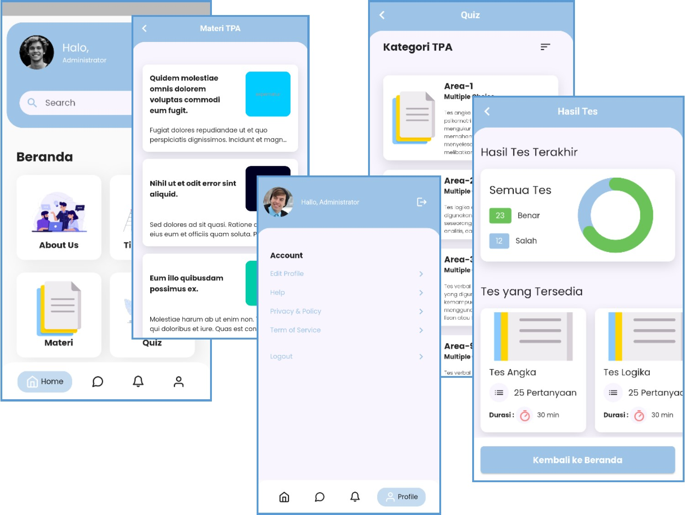

# Project : XCBT - XLPE Computer Based Training 
*********************************************
A Flutter project for XLPE Computer Based Training  
A Task of FIC-10 event by Code With Bahri

# Notes:
- Started at: Week-2 of Nov-23 
- Flutter using FVM 3.13.0
- State Mgt: BLoC
- Backend: [Laravel v.10](https://github.com/maulahaz/lar10-cbt-fic10) 
- DB: MySQL
- Packages: flutter_bloc, http, intl, dartz, equatable, shared_preferences, cached_network_image,  
            flutter_svg, step_progress_indicator, ...

# References:
- [Github: bahrie127/flutter_cbt_app](https://github.com/bahrie127/flutter_cbt_app)
- [Github: bahrie127/laravel-cbt-backend](https://github.com/bahrie127/laravel-cbt-backend)

# Resource References:
- [Colors](https://coolors.co/palettes/trending)
- [SVG Icons](http://svgrepo.com)

# Snapshot:

